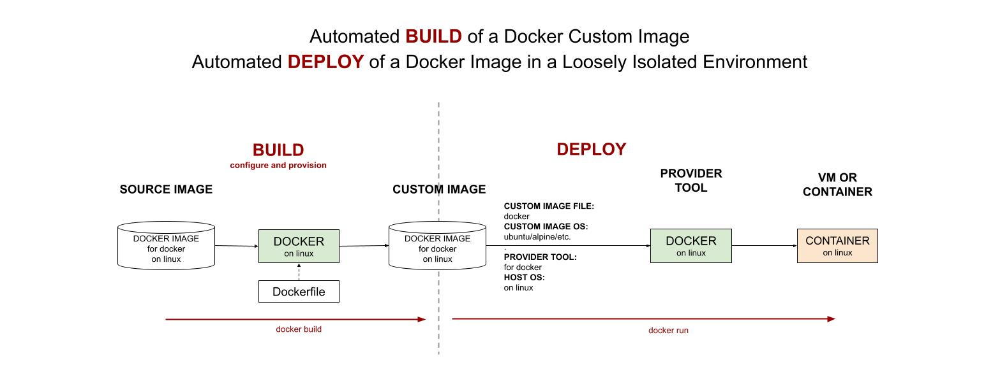

# MY DOCKER IMAGE BUILDS

[](https://codeclimate.com/github/JeffDeCola/my-docker-image-builds/issues)
[](http://jeffdecola.mit-license.org)
[](https://hub.docker.com/u/jeffdecola/)
[](https://jeffdecola.com)

_A place to keep my docker image builds._

tl;dr

```bash
## BUILD DOCKER IMAGE
DOCKER_BUILDKIT=0 docker build -t jeffdecola/compact-multi-stage-build-example .

## PUSH TO DOCKERHUB
docker push jeffdecola/compact-multi-stage-build-example

## DEPLOY DOCKER IMAGE TO CONTAINER
docker pull jeffdecola/compact-multi-stage-build-example
docker run --name compact-multi-stage-build-example -dit jeffdecola/compact-multi-stage-build-example

## OTHER COMMANDS
docker exec -i -t compact-multi-stage-build-example /bin/bash
docker logs -f compact-multi-stage-build-example
docker images
docker ps
```

Table of Contents

* [OVERVIEW](https://github.com/JeffDeCola/my-docker-image-builds#overview)
* [DOCKER IMAGES](https://github.com/JeffDeCola/my-docker-image-builds#docker-images)

Documentation and Reference

* My
  [docker cheat sheet](https://github.com/JeffDeCola/my-cheat-sheets/tree/master/software/operations/orchestration/builds-deployment-containers/docker-cheat-sheet)
* My docker images at
  [DockerHub](https://hub.docker.com/u/jeffdecola/)
* An illustration of how
  [vagrant, docker and packer](https://github.com/JeffDeCola/my-cheat-sheets/tree/master/software/operations/orchestration/builds-deployment-containers/packer-cheat-sheet#vagrant-docker-and-packer)
  build and deploy images
* My
  [docker-remove-old-images.sh](https://github.com/JeffDeCola/my-linux-shell-scripts/tree/master/software/docker-remove-old-images)
  linux script
* This repos
  [github webpage](https://jeffdecola.github.io/my-docker-image-builds/)
  _built with
  [concourse](https://github.com/JeffDeCola/my-docker-image-builds/blob/master/ci-README.md)_

## OVERVIEW

Docker is useful for the automated **BUILD** of a docker custom image.
Docker is also useful for the automated **DEPLOY** of a docker custom image
in an loosely isolated environment. This is useful for easily launching
an App/Service.



## DOCKER IMAGES

* [compact-multi-stage-build-example](https://github.com/JeffDeCola/my-docker-image-builds/blob/master/images/compact-multi-stage-build-example)

  _Using docker to multi-stage build a docker image
  containing the alpine OS._

* [gcloud-kubectl](https://github.com/JeffDeCola/my-docker-image-builds/blob/master/images/gcloud-kubectl)

  _Using docker to build a docker image
  containing the Ubuntu 22.04 OS
  (with gcloud and kubectl)._

* [go-gcloud-packer](https://github.com/JeffDeCola/my-docker-image-builds/blob/master/images/go-gcloud-packer)

  _Using docker to build a docker image
  containing the ubuntu 22.04 OS
  (with go, gcloud and packer)._
